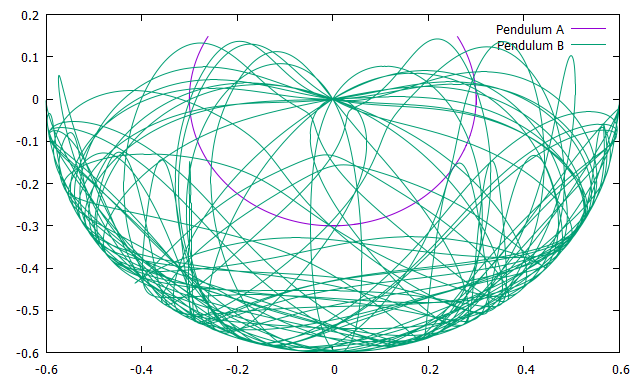

# doublependulum
二重振り子はひとつの振り子にもう一つの振り子をくっつけたような形をしている振り子の系であり、くっつけられた方の振り子（振り子A）は周期的な動きをするのに対し、くっつけた方の振り子（振り子B）は非常に複雑な動きをすることで有名です。  
このような系のことをカオス系とよび、初期値を少しいじるだけで大きく結果に変化が現れ、このような現象をバタフライ効果とも呼びます。  

以下に示す画像は、シミュレーションの結果である、二重振り子の軌跡を表しています。  
