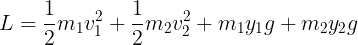

<h1 align="center">Double Pendulum （２重振り子）</h1>

## Introduction
２重振り子はその名の通り、振り子が２個連結しているような振り子です。
振り子は１個繋いでいるだけならば、その軌跡は綺麗な円を描きますが、
２個目を繋げるとその軌跡は不規則的なものとなります。
このような軌跡は「カオス」と呼ばれ、初期条件の設定によって大きくその後のダイナミクスが変わってくることが知られています。（バタフライ効果）

Double pendulum is a system which two pendulums are connected with each other.
It is well known that only one pendulum oscillates with a certain period.
However if two pendulums are connected, the second pendulum oscillates pretty wildly, performing so called "Chaos dynamics".
This kind of chaos dynamic is strongly related to the initial setting.
The small change in initial condition contributes significantly in the movement later. This phenomenon is called "Butterfly phenomenon"

## Calculation

２重振り子は２個目の振り子が不規則的に動くことから、原点を中心としたデカルト座標系で考えるのは難しいと思います。
そのような系ではスカラーであるラグランジアンを用います。
スカラーであることより座標系に依らず計算する事ができるため、正準方程式により容易に座標の式を導くことが出来ます。

Double pendulum performs chaotic movements, resulting the calculation in orthogonal coordinate system difficult.
In such a system, Lagrangian is often used to calculate the positions and momentum.
Thanks to its dimensionless, we can easily acquire the expressions for canonical variables by Hamiltonian equations.

## Solution
２重振り子の時間発展は以下に示すように、カオティックな動きを行います。

The dynamics of double pendulum is chaotic as shown below.

